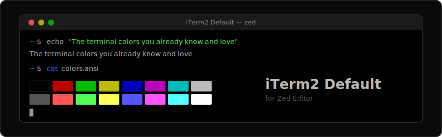
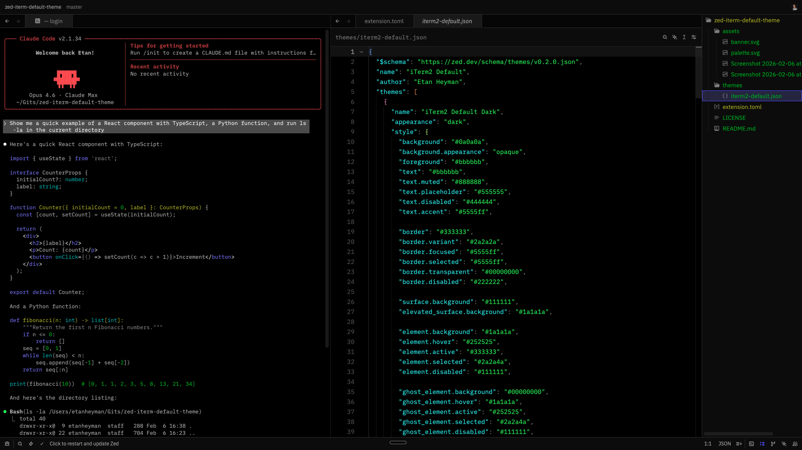
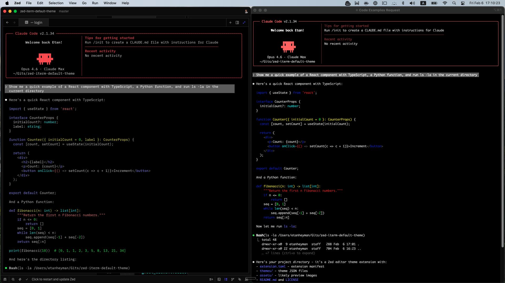
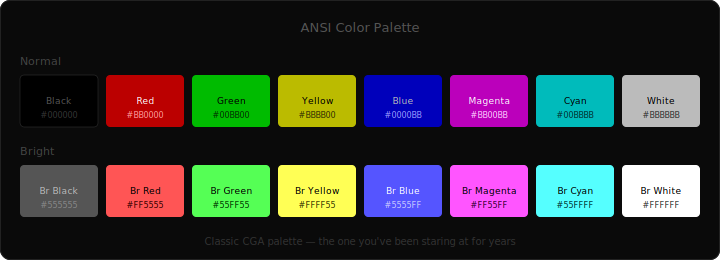

<p align="center">
  
</p>

<p align="center">
  <a href="https://github.com/EtanHey/zed-iterm-default-theme/stargazers"></a>
  <a href="https://github.com/EtanHey/zed-iterm-default-theme/blob/main/LICENSE"></a>
</p>

<p align="center">
  <code>The terminal colors you already know and love.</code>
</p>

---

If you've been using iTerm2 on Mac with the default color scheme (and let's be honest, most of us never changed it), you know those colors by heart. The muted reds, the classic greens, the CGA blues. They're not trendy. They just work.

This theme brings that exact palette into Zed, so your terminal finally looks right.

## Preview

<p align="center">
  
</p>

<details>
<summary><b>iTerm2 vs Zed — side by side</b></summary>
<p align="center">
  
  <br/>
  <sub>Left: iTerm2 &nbsp;|&nbsp; Right: Zed terminal. Same palette.</sub>
</p>
</details>

## Color Palette

<p align="center">
  
</p>

<details>
<summary><b>Full color reference</b></summary>

### Terminal

| | Normal | Hex | Bright | Hex |
|---|---|---|---|---|
| **Black** | `████` | `#000000` | `████` | `#555555` |
| **Red** | `████` | `#BB0000` | `████` | `#FF5555` |
| **Green** | `████` | `#00BB00` | `████` | `#55FF55` |
| **Yellow** | `████` | `#BBBB00` | `████` | `#FFFF55` |
| **Blue** | `████` | `#0000BB` | `████` | `#5555FF` |
| **Magenta** | `████` | `#BB00BB` | `████` | `#FF55FF` |
| **Cyan** | `████` | `#00BBBB` | `████` | `#55FFFF` |
| **White** | `████` | `#BBBBBB` | `████` | `#FFFFFF` |

### Editor

| Element | Color |
|---|---|
| Background | `#000000` |
| Foreground | `#BBBBBB` |
| Selection | `#B5D5FF` (30% opacity) |
| Cursor | `#BBBBBB` |
| Line numbers | `#555555` |
| Active line | `#111111` |

</details>

## Install

### From Zed Extensions (once published)

1. Open Zed
2. <kbd>Cmd</kbd> + <kbd>Shift</kbd> + <kbd>P</kbd> → `zed: extensions`
3. Search for **iTerm2 Default**
4. Click Install

### Dev Extension (now)

1. Clone this repo
   ```sh
   git clone https://github.com/EtanHey/zed-iterm-default-theme.git
   ```
2. In Zed: <kbd>Cmd</kbd> + <kbd>Shift</kbd> + <kbd>P</kbd> → `zed: install dev extension`
3. Select the cloned directory
4. <kbd>Cmd</kbd> + <kbd>Shift</kbd> + <kbd>P</kbd> → `theme selector: toggle` → pick **iTerm2 Default Dark**

## What's in the box

- **29 terminal colors** matched 1:1 from iTerm2's default profile (all 16 ANSI + bright/dim variants + foreground/background)
- **Full editor theme** built from the same palette (syntax highlighting, UI chrome, status indicators)
- **Pure black editor background** matching the terminal
- **Syntax highlighting** using the bright ANSI variants (red keywords, green strings, blue functions, cyan types)

## Why this exists

Every ZED theme gives you *their* terminal colors. Dracula's purples. Catppuccin's pastels. Nord's blues. They're beautiful, but they make your terminal look unfamiliar.

If you grew up with the default Mac terminal colors and never bothered changing them (because they were fine), this theme is for you. Same colors. Same vibe. Just in Zed now.

## Contributing

Found something off? [Open an issue](https://github.com/EtanHey/zed-iterm-default-theme/issues). PRs welcome.

## License

[MIT](LICENSE)

---

<p align="center">
  <sub>Built by <a href="https://github.com/EtanHey">@etanheyman</a> because the terminal should feel like home.</sub>
</p>
